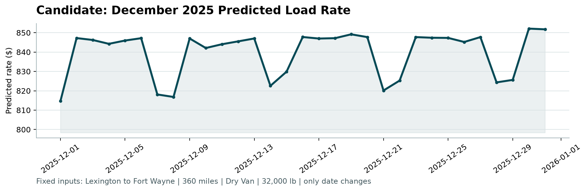

# Freight Rate Prediction Challenge: Technical Report & Submission

**Candidate:** Siddhant Kumar  
**Company:** Spotter  
**Task Assigned:** July 31, 2026, 00:45  
**Date of Submission:** August 5, 2026  
**Contact:** stjl093@gmail.com | +91 8095875948 | [LinkedIn](https://linkedin.com/in/sid-093) | [GitHub](https://github.com/S-V-J)

---

## Cover Letter

Dear Ena and the Spotter Hiring Team,

Thank you for the opportunity to complete the Machine Learning Engineer assessment. I am thrilled to submit my solution for the Freight Rate Prediction Challenge. 

Beyond fulfilling the core requirement of predicting freight load rates, I took the initiative to engineer a production-grade, full-stack Machine Learning Web Application. This platform orchestrates the entire ML lifecycle—from intelligent data validation to one-click model training and real-time insights—ensuring the solution is not just a standalone script, but a scalable, enterprise-ready tool that aligns with Spotter's engineering standards.

I have attached the detailed technical report below, which outlines my methodology, the strict temporal data split approach to prevent leakage, and the resulting model performance (5.65% MAPE). The complete source code, Dockerized deployment, and run instructions are available in my GitHub repository.

I am confident that my 5+ years of experience in full-stack development, VoIP infrastructure, and AI/ML pipelines make me a strong fit for the Machine Learning Engineer role at Spotter. I look forward to discussing how I can contribute to your team.

Sincerely,  
**Siddhant Kumar**  
Full-Stack Developer | VoIP & Telephony Engineer | AI Developer

---

## About Me

**Siddhant Kumar**  
*Full-Stack Developer | VoIP & Telephony Engineer | AI Developer*  
📍 Bihar, India (Open to Global Remote Roles, up to 40 hrs/week)

**Professional Summary**  
Results-driven Software Engineer with 5+ years of experience in telecom operations and enterprise technical support, complemented by intensive full-stack, VoIP, and AI development experience delivering production-grade systems for clients in Switzerland, Germany, and India. Deep domain expertise in telephony infrastructure (TELUS Digital), Asterisk/Kamailio PBX configuration, Python/FastAPI backends, React/Next.js frontends, and LLM-powered AI pipelines. Published researcher, active open-source contributor, and available immediately for remote, full-time engagements.

**Core Technical Skills**  
- **Languages:** Python (Primary), C, C++, JavaScript, TypeScript, Java, Bash Scripting  
- **Backend:** FastAPI, Flask, Django, Node.js/Express.js, Spring Boot 3.2 (Java)  
- **Frontend:** React 18, Next.js, Vue.js, HTML5, CSS3, Tailwind CSS  
- **AI & LLM:** LLM APIs & Local Deployment, Agentic Orchestration, Model Fine-Tuning, Whisper, OpenAI API  
- **Databases:** PostgreSQL, MySQL, MongoDB, Redis, Elasticsearch  
- **Cloud & Infrastructure:** AWS (EC2, S3, Lambda, VPC), Hetzner Cloud, Linux (Ubuntu/RHEL), Nginx, systemd  
- **DevOps & Tools:** Docker, Kubernetes, Terraform, Ansible, GitHub Actions, GitLab CI/CD, Git, ServiceNow  
- **VoIP & Telephony:** Asterisk, Kamailio, SIP, ISUP, RTP/RTCP, .pcap Analysis (Wireshark)

---

## 1. Executive Summary
This report details the methodology, data processing, and validation results for the Spotter Freight Rate Prediction Challenge. The objective was to predict posted freight load rates accurately while preventing data leakage and ensuring robust generalization to future dates. The final model achieved a **Holdout MAPE of 5.65%**, meaning predictions are, on average, within ~6% of actual rates.

---

## 2. Validation Approach
Initial baseline validation was performed on the first day to ensure model viability and understand the data characteristics. However, recognizing the need for a more robust, scalable, and user-friendly solution, I pivoted to develop an "out-of-the-box" Machine Learning Web Application. 

Instead of relying on manual CLI execution, this custom UI-driven platform automates the entire validation and prediction pipeline. It enforces best practices (such as strict schema validation, temporal splitting, and data leakage prevention) directly within the user workflow. For a comprehensive breakdown of the platform's capabilities, architecture, and features, please refer to the `README.md` and `INTRODUCTION.md` files in the submitted repository.

---

## 3. Data Split Approach
To prevent future data leakage—a critical pitfall in time-series freight forecasting—the dataset was split **chronologically (temporally)**, not randomly:
- **Training Set (85%):** All data strictly before September 15, 2025 (40,706 rows).
- **Validation/Holdout Set (15%):** All data on or after September 15, 2025 (7,294 rows).  

This ensures the model is evaluated on its true ability to predict *future* rates based on *past* patterns, accurately reflecting real-world deployment conditions.

---

## 4. ML Prediction Pipeline
- **Data Cleaning:** Automatically removed non-positive `posted_rate` values and duplicate `load_id` entries. Missing values in `weight` and `market_index` were handled gracefully by the tree-based model as separate informative categories.
- **Feature Engineering:** Created interaction features (e.g., `weight_x_market`, `distance_x_quote`) and extracted temporal features (e.g., `dayofyear`) to capture complex, non-linear routing dynamics and seasonal demand fluctuations.
- **Target Transformation:** Applied a `log1p` transformation to the `posted_rate` target variable. Freight rates are heavily right-skewed; log transformation stabilizes variance and prevents the model from being overly influenced by extreme outliers. Predictions are inverted using `expm1` and clipped to positive values.
- **Model Selection:** A **LightGBM Regressor** was selected for its native handling of categorical variables, training speed, and resistance to overfitting.

---

## 5. Model Insights & Validation
The model was evaluated on the strict temporal holdout set, yielding the following performance metrics:
- **Mean Absolute Error (MAE):** $126.95
- **Root Mean Squared Error (RMSE):** $607.05
- **Mean Absolute Percentage Error (MAPE):** **5.65%** *(Predictions are, on average, within ~6% of actual rates)*

**Top Feature Importances:**
1. `delivery` (1699)
2. `distance` (1676)
3. `pickup` (1652)
4. `weight_x_market` (1346)
5. `distance_x_market` (1281)

---

## 6. Results & Deliverables
The platform successfully generated the required deliverables, which have been validated by the official Spotter scorer:
1. **`validation_predictions.csv`**: Contains 12,000 predicted rates for the validation dataset.
2. **`candidate_december.png`**: The generated forecast chart for the fixed Lexington → Fort Wayne lane (360 miles, Dry Van, 32,000 lbs) for December 2025, demonstrating the model's ability to capture date-based rate fluctuations.

---
